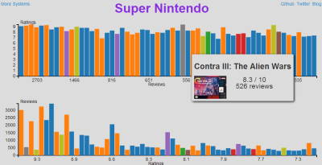

# [Video Game Ratings](http://blog.brainss.me/vg-ratings)

A collection of video game reviews from various systems shown through graphs.

#### Graph Presentation
The source code for the graphs can be found in the
[gh-pages](https://github.com/brainss/vg-ratings/tree/gh-pages) branch.

#### Data Collection
The data was retrieved using `spider.js` in the [master](https://github.com/brainss/vg-ratings/tree/master). All datasets come [GameFAQs](https://www.gamefaqs.com)

##### Usage
``` plaintext
$ node spider.js [system]
```

`spider.js` accepts a system argument. This argument will default to `snes`.


